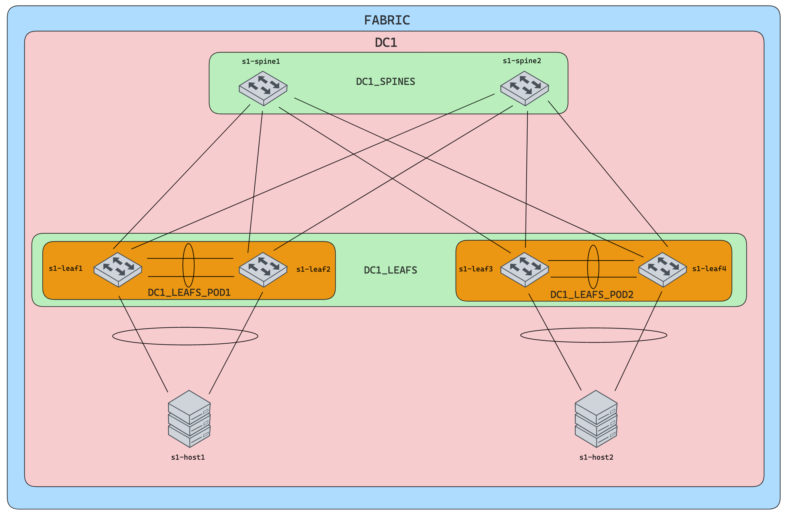

# Demo

## Demo 1 - Single DC L3LS deployment using eAPI

### Topology



### Deploying

1. Apply the following configurations to `s1-host1` and `s1-host2` either using CLI or CVP.

```shell
host_configlets
├──  AVD_L3LS-s1-host1.cfg
└──  AVD_L3LS-s1-host2.cfg
```

2. Run the following playbook to generate and deploy the configuration

```shell
$ ansible-playbook playbooks/fabric-deploy.yml
```

3. Login to the end host devices and run end-to-end pings

```shell
s1-host1#ping vrf SERVER_A  10.10.21.10
PING 10.10.21.10 (10.10.21.10) 72(100) bytes of data.
80 bytes from 10.10.21.10: icmp_seq=1 ttl=62 time=9.81 ms
80 bytes from 10.10.21.10: icmp_seq=2 ttl=62 time=5.18 ms
80 bytes from 10.10.21.10: icmp_seq=3 ttl=62 time=5.26 ms
80 bytes from 10.10.21.10: icmp_seq=4 ttl=62 time=5.41 ms
80 bytes from 10.10.21.10: icmp_seq=5 ttl=62 time=5.09 ms

--- 10.10.21.10 ping statistics ---
5 packets transmitted, 5 received, 0% packet loss, time 36ms
rtt min/avg/max/mdev = 5.090/6.154/9.817/1.834 ms, ipg/ewma 9.001/7.921 ms

s1-host1#ping vrf SERVER_A  10.10.22.10
PING 10.10.22.10 (10.10.22.10) 72(100) bytes of data.
80 bytes from 10.10.22.10: icmp_seq=1 ttl=62 time=8.94 ms
80 bytes from 10.10.22.10: icmp_seq=2 ttl=62 time=4.99 ms
80 bytes from 10.10.22.10: icmp_seq=3 ttl=62 time=5.15 ms
80 bytes from 10.10.22.10: icmp_seq=4 ttl=62 time=5.15 ms
80 bytes from 10.10.22.10: icmp_seq=5 ttl=62 time=4.64 ms

--- 10.10.22.10 ping statistics ---
5 packets transmitted, 5 received, 0% packet loss, time 33ms
rtt min/avg/max/mdev = 4.641/5.778/8.941/1.593 ms, ipg/ewma 8.270/7.297 ms


s1-host1#ping vrf SERVER_A  10.10.12.10
PING 10.10.12.10 (10.10.12.10) 72(100) bytes of data.
80 bytes from 10.10.12.10: icmp_seq=1 ttl=63 time=3.63 ms
80 bytes from 10.10.12.10: icmp_seq=2 ttl=63 time=2.47 ms
80 bytes from 10.10.12.10: icmp_seq=3 ttl=63 time=2.61 ms
80 bytes from 10.10.12.10: icmp_seq=4 ttl=63 time=2.39 ms
80 bytes from 10.10.12.10: icmp_seq=5 ttl=63 time=2.35 ms

--- 10.10.12.10 ping statistics ---
5 packets transmitted, 5 received, 0% packet loss, time 13ms
rtt min/avg/max/mdev = 2.357/2.696/3.635/0.480 ms, ipg/ewma 3.251/3.145 ms
```

4. Check the BGP routes and states from VTEPs
